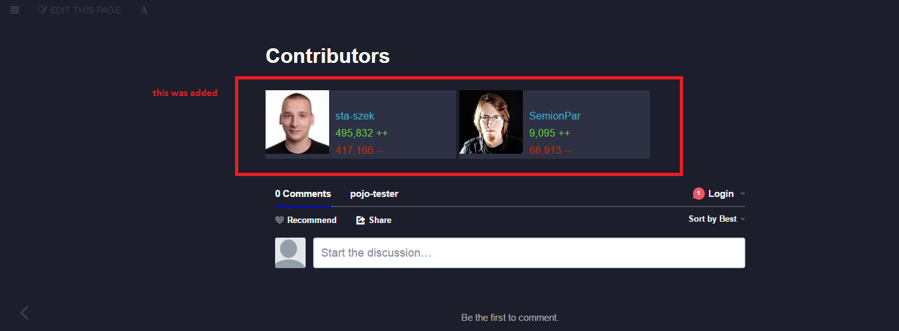

This plugin insterts contributions from GitHub service via GitHub API.

<span class="badge-npmversion"><a href="https://npmjs.org/package/gitbook-plugin-githubcontributors" title="View this project on NPM"></a></span>
<span class="badge-npmdownloads"><a href="https://npmjs.org/package/gitbook-plugin-githubcontributors" title="View this project on NPM"></a></span>
# Features

* adds contributors from GitHub via GitHub API (0.0.1)
* link to contributors page (0.1.0)
* background changes when theme changes (0.1.0)

# Usage

Add plugin and it's configuration to your `book.json` file:

```
"plugins": [
  "githubcontributors"
],
"pluginsConfig": {
  "githubcontributors": {
    "githubOwner": "username",      // GitHub username e.g. sta-szek
    "githubRepository": "repo-name" // GithHub repo name e.g. pojo-tester
  }
}
```

Then you have to tell plugin, where you want the content to be inserted.
To do this use gitbook block:

```


```

# Sample result


# Feel free to contribute!
